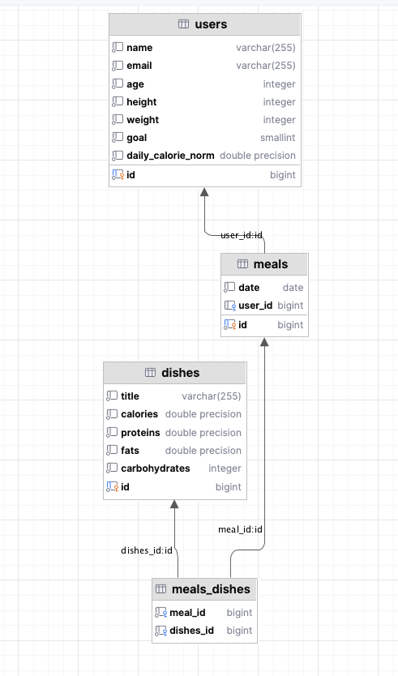

# dishes-tracker

## Описание
REST-API сервис для отслеживания дневной нормы калорий пользователя и учета съеденных блюд.

Функционал:
+ Добавление и получение пользователей по уникальному идентификатору.
+ Расчёт дневной нормы калорий в зависимости от введённых параметров пользователя.
+ Добавление и получение блюд по уникальному идентификатору.
+ Внесение и получение информации о приёмах пищи.
+ Получение отчётов:
  + Отчёт за день с суммой всех калорий и приёмов пищи.
  + Проверка, уложился ли пользователь в свою дневную норму калорий
  + История питания по дням


Схема базы данных:



Постман коллекция расположена в файле `calories.postman_collection.json`

## Инструкция по запуску:

#### 1. Склонировать репозиторий
```git clone https://github.com/Soudagh/dishes-tracker.git```

#### 2. Настройка окружения (env)
Добавить переменные окружения в `conficuration properties` или `.env` файл
+ `DATABASE_URL`
+ `DATABASE_USERNAME`
+ `DATABASE_PASSWORD`

#### 3. Настроить базу данных
Создать базу данных и инициализировать таблицы при помощи файла `update-schema.sql`

#### 4. Запустить Testtask1221Application.java
```
./gradlew bootRun  # For macOS/Linux
gradlew.bat bootRun  # For Windows
``` 
Или запустить Testtask1221Application.java в IntelliJ IDEA.
